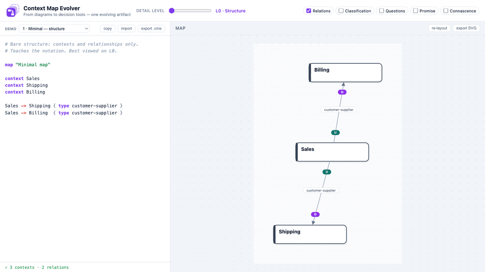
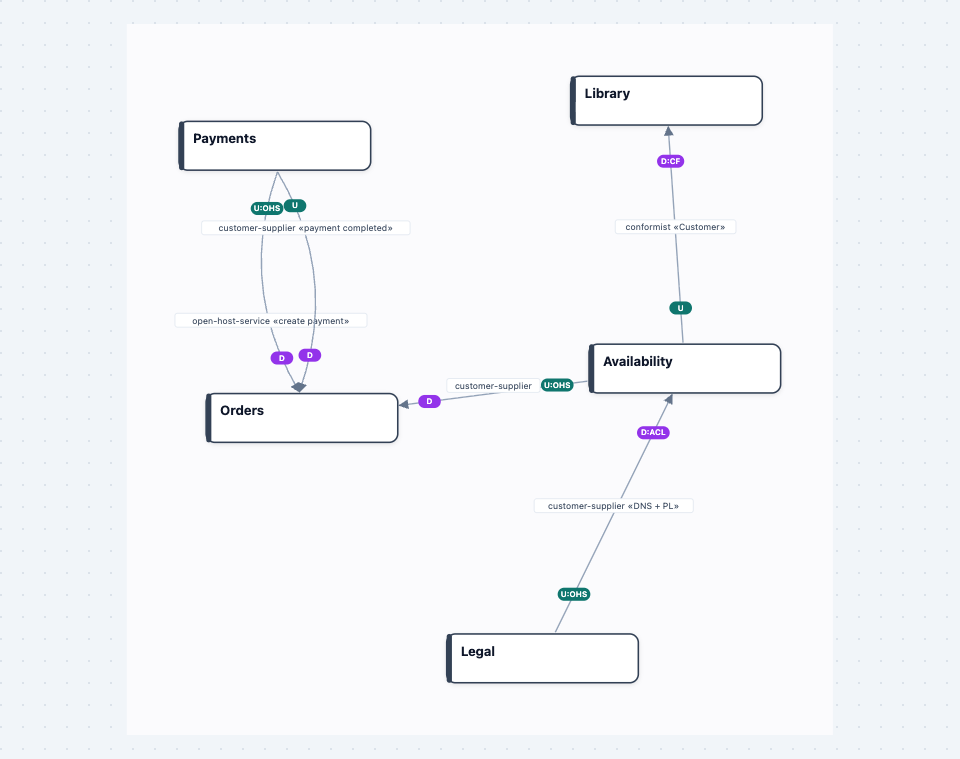
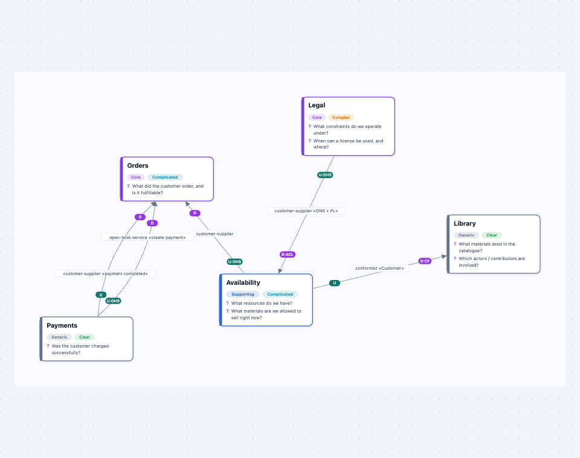
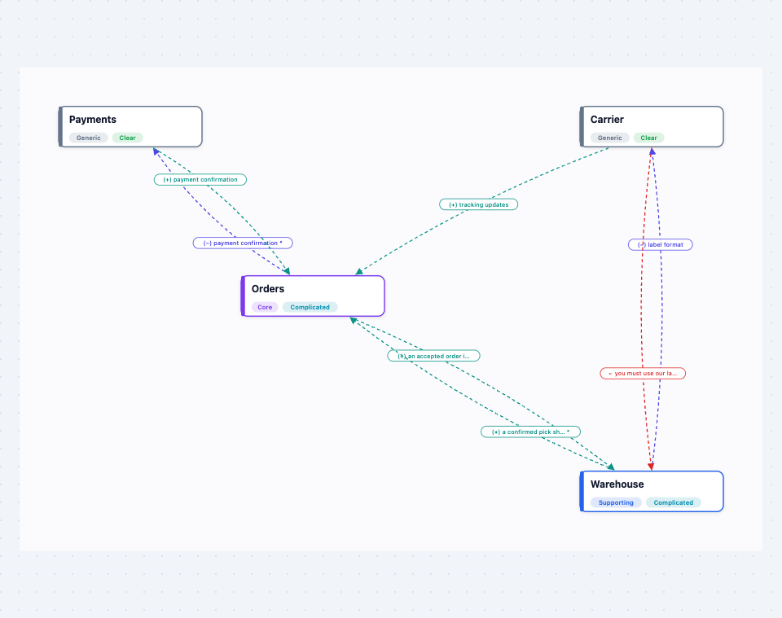
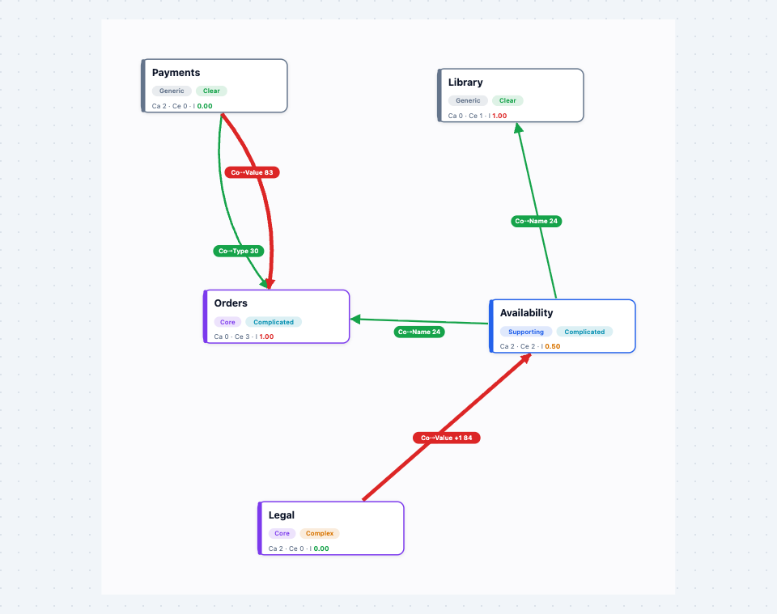
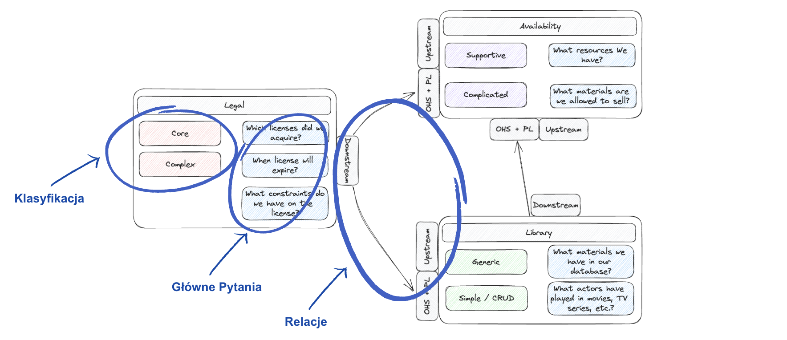

<p align="center">
  
</p>

<h1 align="center">Context Map Evolver</h1>

[](https://github.com/BlackDante/context-map-evolver/actions/workflows/ci.yml)
[](https://www.npmjs.com/package/context-map-evolver)
[](LICENSE)


**DDD context maps as code — one model that evolves from a diagram into a decision tool.**

**[▶ Try it live — cme.kamilkielbasa.tech](https://cme.kamilkielbasa.tech/)** · [npm](https://www.npmjs.com/package/context-map-evolver) · [DSL reference](docs/DSL.md) · [Examples](examples)

**New in 0.2 — open a folder of your own `.cme` files, straight from npm:**

```bash
npx context-map-evolver host ./architecture
```

One command: a local server starts, your browser opens, and every `.cme` file
under the folder is in the picker — re-read whenever it changes on disk.
Nothing is installed globally and nothing leaves your machine. Details in
[Use it on your own files](#use-it-on-your-own-files).

> [!WARNING]
> **Early beta, and vibe-coded to a frankly irresponsible degree.** Most of this
> code was written in conversation with an AI, at speed, because the idea was
> more interesting than the ceremony. Expect rough edges, a DSL that may still
> change, and the occasional layout that makes you press *re-layout*.
>
> That is also why the app is what it is: **a static frontend that runs entirely
> in your browser — no backend, no accounts, no database.** Nothing you type
> leaves your machine, and there is no server of mine for a bug to take down or
> leak from. Your models live in `.cme` files that you export and keep yourself.
>
> So: **run it yourself** (`npx context-map-evolver host <dir>` opens the app
> on your `.cme` files, or `npm run build` and serve `dist/` from anywhere that
> serves files) — or just use the instance at
> **<https://cme.kamilkielbasa.tech/>**, provided as-is, with no uptime promises.



A context map usually starts as boxes and arrows on a whiteboard — and stays
there. The interesting questions come later: *Which of these contexts deserves
our best people? What has each team actually promised the others? Which
integration will hurt most when it changes?* Answering them tends to mean
drawing a second, third and fourth diagram that drift apart within a week.

Context Map Evolver keeps **one text model** and a **detail-level slider**. Each
level is a different *lens* over the same map:

| | Lens | Answers | Built on |
|---|---|---|---|
| **L0** | Structure | Who integrates with whom, who is upstream, through which pattern? | DDD context mapping (Evans) |
| **L1** | Strategic | Where do we invest? What kind of problem is this? What does each context exist to answer? | Core / Supporting / Generic subdomains · Cynefin (Snowden) · key questions |
| **L2** | Promise Theory | What has each context voluntarily committed to — and where is behaviour being *imposed* instead? | Promise Theory (Burgess) |
| **L3** | Coupling | Which boundary is riskiest? Do dependencies point towards stability? | Connascence (Page-Jones) · Ca / Ce / Instability and the Stable Dependencies Principle (Martin) |

| L0 · Structure | L1 · Strategic |
|:-:|:-:|
|  |  |
| **L2 · Promise Theory** | **L3 · Coupling & Connascence** |
|  |  |

The approach is **heavily inspired by the [C4 model](https://c4model.com/)**
(Simon Brown). C4 showed that one architecture is best told as a small set of
views at different levels of detail, each for a different conversation, rather
than as a single diagram that tries to say everything. Context Map Evolver
applies the same idea to DDD context maps: where C4 zooms *in* — context,
containers, components, code — the slider here moves *across* kinds of reasoning
over the same set of bounded contexts.

Lenses are **not** cumulative overlays: the Promise lens hides structural
arrows, the Coupling lens hides promises and questions. Each view shows only
what that kind of reasoning needs, so the map stays readable. Five toggles let
you mix layers by hand when you want to explore.

## The model is text

```
map "Media Rights Platform"

context Legal {
  subdomain core
  cynefin complex
  question "When can a license be used, and where?"
  promise + "authoritative licensing rules" to Availability
}

context Availability {
  subdomain supporting
  cynefin complicated
}

# source is UPSTREAM, target is DOWNSTREAM
Legal -> Availability {
  type customer-supplier
  upstream OHS
  downstream ACL
  coupling 2
  connascence meaning distant 3
  connascence value distant 2
}
```

Start with two `context` lines and an arrow; add the rest when the conversation
needs it. Because it is text, a model diffs cleanly in a pull request and lives
next to the code it describes.

**→ [Full DSL reference](docs/DSL.md)** — every keyword, the grammar, how the
scores are computed, error messages, and recipes.

## Features

- **Live editor** — the map re-renders on every keystroke, with syntax
  highlighting and line-numbered diagnostics. The parser recovers from errors,
  so a half-typed line never blanks the diagram.
- **Automatic layout** — deterministic (same model → same picture, no jitter
  during a talk), untangles edge crossings, leaves room for edge labels.
  **re-layout** tries another arrangement; `at x y` pins a context by hand.
- **Parallel and bidirectional relations** — declare `A -> B` as many times as
  you need; the edges fan out with their own labels.
- **Import / export** — `.cme` files (plain DSL text) and standalone **SVG** for
  slides and docs.
- **Five built-in demos**, each one level richer than the last — also available
  as files in [`examples/`](examples).
- **Host a folder** — `npx context-map-evolver host <dir>` serves the app with
  your `.cme` files in the picker and reloads them as they change on disk.

## Use it on your own files

Keep your models as `.cme` files next to the code they describe and open the
whole folder at once — no install, no upload:

```bash
npx context-map-evolver host ./architecture
```

This starts a local server on `127.0.0.1`, opens the app in your browser, and
lists every `.cme` file under the directory (recursively) in the file picker,
next to the built-in demos. Files are re-read when they change on disk, so you
can edit in your IDE and watch the map follow — the reload is skipped while the
text in the browser has unsaved edits of its own. Point it at a single file to
open that one first:

```bash
npx context-map-evolver host docs/context-map.cme --port 8080 --no-open
```

| Option | |
|---|---|
| `-p, --port <n>` | port to listen on (default: first free port from 5180) |
| `--no-open` | do not open the browser |
| `-h, --help` · `-v, --version` | |

The server is read-only: it serves the app and the files, nothing else, and only
listens on localhost. Saving still goes through **export .cme**.

## Develop it

```bash
npm install
npm run dev        # http://localhost:5173 (demos only — hosted mode needs the built CLI)
npm run host       # build first, then: the CLI on the examples/ folder
```

| | |
|---|---|
| `npm test` | unit tests (Vitest) |
| `npm run test:coverage` | tests with a coverage report |
| `npm run typecheck` | `tsc` in strict mode |
| `npm run build` | static bundle in `dist/` — copy it to any static host (asset paths are relative, so a subfolder works too) — plus the CLI in `dist/cli/` |
| `npm run check` | typecheck + tests + build, what CI runs (and `prepublishOnly`) |
| `npm publish` | publishes the package; `files` whitelists `bin/`, `dist/`, `examples/` and the DSL reference |

Requires Node ≥ 20.19.

## How it is built

TypeScript and hand-written SVG. **No runtime dependencies** — no diagram
library, no graph library, no editor component, no framework. The production
bundle is ~16 kB gzipped, HTML and CSS included.

```
DSL text ──parse──▶ ContextMap ──layout──▶ positions ──render──▶ SVG string
                        │
                        └──analysis──▶ risk scores · Ca/Ce/instability ──▶ badges & node footers
```

```
src/
  model.ts      the single ContextMap model + metadata tables for every level
  parser.ts     tokenizer + recursive-descent parser; never throws, always recovers
  layout.ts     deterministic force-directed layout, best of several starts
  geometry.ts   pure helpers: border points, Bézier points, edge fan-out, text fitting
  render.ts     ContextMap + active layers → SVG markup (a pure function)
  analysis.ts   connascence scoring, Ca/Ce/instability, SDP check, strategic heuristics
  highlight.ts  ~1 kB syntax highlighter layered behind a transparent <textarea>
  levels.ts     the four lens presets
  flags.ts      feature flags — unfinished features ship dark
  host.ts       client side of hosted mode: api discovery, picker values
  main.ts       DOM wiring: editor ↔ map, slider, toggles, import/export
cli/
  main.ts       `context-map-evolver host`: resolves the target, listens, opens the browser
  host.ts       zero-dependency http server: the app + /api/files + /api/events (SSE on change)
  files.ts      recursive .cme discovery, path-traversal-safe resolution
  args.ts       argument parsing
```

A few decisions worth pointing out:

- **Everything except `main.ts` is pure.** `render()` returns a string and never
  touches the DOM, which is what makes the SVG output unit-testable: the tests
  parse it with a strict XML parser and assert on real elements and geometry —
  arrow endpoints on box borders, curves bowing to opposite sides, labels not
  stacking, risk encoded as colour, thickness and arrowhead.
- **The parser is built for a live editor**, not a compiler: it reports every
  problem with a line number, keeps whatever it understood, and resynchronises
  at the next declaration when a `}` is missing.
- **Layout is deterministic by construction.** Starting positions come from a
  hash of the context names, so there is no `Math.random()` anywhere. A force
  simulation cannot untangle edges that start crossed, so several starting
  orders are simulated and the tidiest result wins (no edge hidden under a box,
  fewest crossings, then smallest area).
- **All user text is escaped on the way out** — models are meant to be shared as
  files, so the DSL is treated as untrusted input.

220+ tests, ~99% line coverage of everything outside `main.ts`.

## Feature flags

Work in progress ships dark behind a flag (`src/flags.ts`), so `main` is always
deployable. Flags are off by default; switch one on for a single visit with
`?features=<name>`, or for a whole build with `VITE_FEATURES=<name> npm run build`.

| Flag | What it enables |
|---|---|
| `analysis` | *Experimental.* A side panel that reads the model back to you: investment advice per subdomain, classification smells, the promise ledger, coupling per context, Stable Dependencies violations, and boundaries ranked by connascence risk. |

## Where it started

The tool grew out of a talk about treating a context map as an
artifact that *evolves* rather than five diagrams that drift apart. This is the
hand-drawn map the running example is based on:



## Roadmap

- Finish the analysis panel and take it out from behind its flag.
- Promise Theory: detect a `+` promise with no matching `-` (and vice versa).
- A map-wide "what to decouple first" ranking combining connascence risk with coupling weight.
- PNG export.
- Import from [Context Mapper](https://contextmapper.org/) CML.

## Further reading

- Simon Brown — the [C4 model](https://c4model.com/) (levels of detail over one architecture — the main inspiration for the slider)
- Eric Evans — *Domain-Driven Design* (context mapping, subdomains)
- Dave Snowden — the [Cynefin framework](https://thecynefin.co/about-us/about-cynefin-framework/)
- Mark Burgess — [*Thinking in Promises*](http://markburgess.org/promises.html)
- Meilir Page-Jones — *What Every Programmer Should Know About Object-Oriented Design* (connascence); [connascence.io](https://connascence.io/)
- Robert C. Martin — *Agile Software Development* (afferent/efferent coupling, Stable Dependencies Principle)

## License

[MIT](LICENSE) © Kamil Kiełbasa
